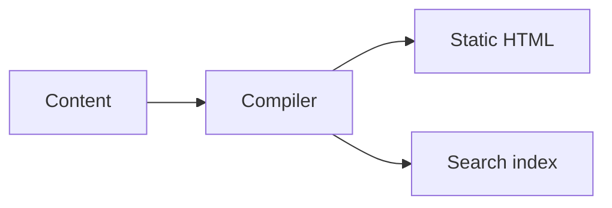

# Mermaid

Foldocs recognizes fenced code blocks whose language is `mermaid`. No custom MDX
component or Remark plugin is required.

## Write a diagram

````md

````


## Loading behavior

The compiler marks routes that contain Mermaid nodes. The Foldkit runtime then
loads Mermaid only on those routes, renders each diagram, and avoids adding the
renderer to pages that do not need it.

## Theme changes

Changing between light and dark mode rerenders diagrams with the corresponding
Mermaid theme. The source is retained, so repeated rendering does not depend on
parsing generated SVG output.

## Failure fallback

Before hydration—and if the optional renderer cannot load—the page displays the
original diagram source in a code block. This keeps prerendered pages readable,
searchable, and suitable for Markdown and LLM output.

## Authoring guidelines

- Give nodes short, descriptive labels.
- Prefer left-to-right flow for wide desktop documentation.
- Verify dense diagrams on a mobile viewport.
- Keep essential explanations in prose rather than only inside the diagram.
